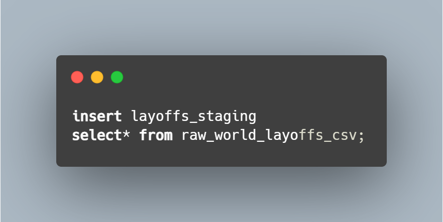
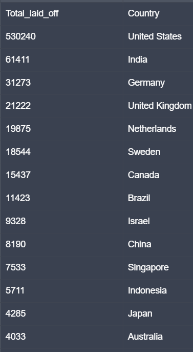
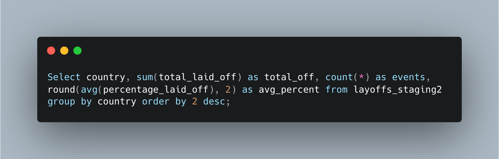
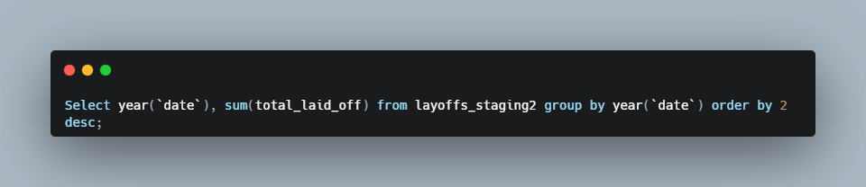
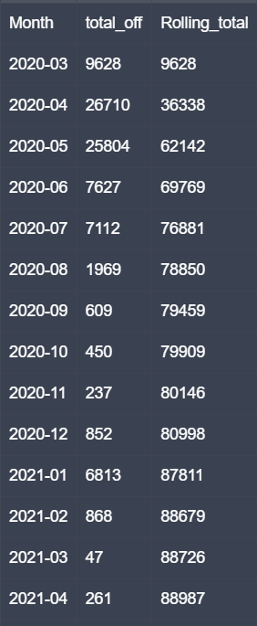
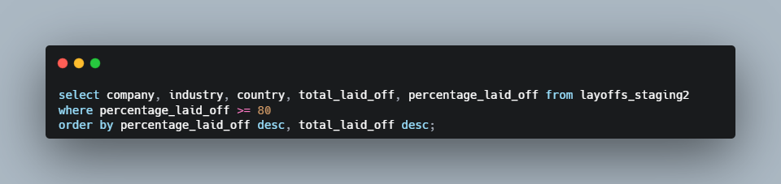

# Global Layoffs SQL Case Study  
---

## 💬 Have You Ever Wondered What MASS Layoffs Really Look Like Behind the Scenes?

Headlines will tell you:

> “Tech company lays off 10,000 employees.”  
> “Finance giant cuts 18% of its workforce.”  
> “Thousands laid off due to economic uncertainty.”

But behind these headlines are even deeper questions:

- **Which industries are actually collapsing the fastest?**  
- **Which countries are hurting the most?**  
- **Are layoffs slowing down — or are we just getting started?**  
- **Which companies laid off more people than entire nations?**  
- **Are certain regions much more unstable than others?**

Therefore, in this project I aimed to answers these questions using real global layoffs data, along with MySQL real-world analysis to uncover the truth behind global layoffs across multiple years and thousands of events.

But before we dive into charts and trends.
let’s remember the human side of this story.
These arent' just numbers... 
**They’re careers, families, dreams, disappointments, and fresh starts.**.
---

# 🎯 Why I Wanted to Analyze Layoffs

Like many others, I watched jobs come and go:

- One week a tech company cuts 12,000 people  
- The next week, startups collapse overnight  
- Departments wiped out completely  
- Hiring freezes everywhere  
- People with 10+ years of experience suddenly out of work  

And I wondered:

> **“Is this normal? Are these just isolated incidents… or part of a bigger global pattern?”**

So I decided to use SQL and a little bit of Tableau visuals to uncover the truth.

I wanted this project to blend:

- My real-world **banking & finance experience**  
- My **SQL-Tableau analysis skills**  
- A dataset large enough to reveal global economic signals  
- And a storytelling approach to sum it all up!

---

# What Readers gain from This Project

By the time you finish reading, you’ll understand:

### ✔️ Which industries suffered the deepest cuts  
### ✔️ Which countries carried the heaviest burden  
### ✔️ Which companies topped yearly layoff rankings  
### ✔️ How layoffs evolved month-by-month  
### ✔️ Which companies almost *collapsed entirely* (80–100% layoffs)  
### ✔️ How global economic stress shows up in workforce data

This is real-world, practical business intelligence — not just data results.

---

# 📚 About the Dataset

You can download the file here 👉 [Raw Data (CSV)](data/Raw_Global_layoffs_file.csv)

The dataset contains **global layoff events** with:

- Company  
- Country  
- Industry  
- Count of employees laid off — Total Laid off
- Percentage of workforce laid off — Percentage Laid Off
- Stage (startup maturity)  
- Funds raised  
- Date of event (messy formats)

*But before analysis, it needed serious cleaning.*

Real data → real mess:

- Duplicate records
- Inconsistent formatting  
- Missing values
- Irregular spacing  
- Blank rows
- Non-standardized fields

So before analysis came **data cleaning**.

---

#  1. Data Cleaning Phase

As any analysis, this dataset required cleaning, easily one of the most crucial parts for reliable insights.

---

## 🩹 Step 1 — Create a Staging Table  
Never touch raw data. Make a safe copy.

---

## 🗄 Step 2 — Insert Raw Data into the Staging Table

---

## 🧹 Step 3 — Detect and Remove Duplicates  
This dataset contained numerous duplicate records, so I used the `ROW_NUMBER()` function to identify them. Next, I created a new staging table, `layoffs_staging2`, to remove the duplicates. This approach bypassed the MySQL limitation that prevents the direct deletion of duplicate rows using CTE, ensuring that only distinct values were retained in the new table.

Now the data is clean enough for the following sections of Exploratory Data Analysis (EDA).

---

# 🏭 2. Industry-level Layoff Severity — Two Ways of Measuring the Same Story
---
To understand **which industries cut the deepest?**, I looked at layoffs in two different ways. 

## First Way: Average % of Workforce Laid Off (Company-level Severity)
  

 
---
This metric shows how aggressively companies within each industry cut their staff. 
- **Aerospace** → the most severe average layoffs (~29%)  
- **Construction, Crypto, Energy, Food, Travel** → consistently high (19–22%)  
- **Healthcare & Education** surprisingly high  
- **Finance** still averages **~15% per event**

*Key Takeaway:* Industries like **Aerospace, Crypto, Travel, and Construction** have extremely high average percentage cuts because many companies inside them executed deep, structural layoffs. 

Revealing how intense layoffs were at the company level.

---
## Second Way: Weighted Industry Layoff % (Industry-Wide Severity)

 

In this `Tableau` representation, I used Tableau’s calculated field interface to build a weighted percentage metric that adjusts for company size and reflects how much of each entire industry’s workforce was actually affected. The dataset includes company-level percentages (for example, one company might lay off 40% while another lays off 100%), but simply averaging these values can distort the true picture.

Instead, I created a calculated field that weights each layoff event by the number of employees affected. This ensures that large-scale layoffs influence the results proportionally, while small startup collapses don’t overwhelm the analysis. The weighted metric provides a far more accurate representation of how deeply each industry was impacted overall, offering a much clearer sense of where the **deepest structural damage** occurred across the global economy.

For example:

- Crypto companies show many 80–100% layoffs (because small startups failed),
BUT the weighted impact is only ~26%,
meaning one out of four crypto jobs disappeared industry-wide.

- Large industries like Tech or Retail show lower weighted percentages
but extremely high total layoffs — meaning layoffs were widespread but distributed.

To wrap up, this metric reveals how deeply layoffs cut into the entire industry’s workforce, not just individual companies.

---

# 🌍 3. Country-Level Analysis  
**Which countries experienced the highest TOTAL layoffs?**

---

---

## Layoffs by Country (Deeper Breakdown)

- 🇺🇸 United States dominates with ~530,000 layoffs, far exceeding every other country in the dataset.
The U.S. alone represents 60–70% of all global layoffs, driven primarily by large tech firms, venture-funded companies, and corporate restructurings after years of rapid expansion.
- 🇮🇳 India follows with ~61,000 layoffs, reflecting the scale of its tech outsourcing sector and hiring freezes post-pandemic.
- 🇩🇪 Germany (≈31k) and 🇬🇧 United Kingdom (≈29k) show significant cuts, mostly tied to financial services, auto manufacturing, and European recession pressures.
- 🇳🇱 Netherlands, 🇦🇺 Australia, 🇨🇦 Canada, and 🇮🇱 Israel also experienced notable workforce reductions, especially in tech, fintech, and high-growth startups.
---

🔍 What These Numbers Actually Suggest
The outsized U.S. layoffs aren’t just a reflection of company count—they’re a reflection of risk appetite and business model:
- The U.S. has more tech giants and high-growth startups than any other country.
- These companies scaled aggressively during 2020–2021, then rapidly downsized when macroeconomic conditions shifted.
- The “hire fast → fire fast” cycle is structurally more common in the U.S. labor market compared to Europe or Asia.

Meanwhile:
- India’s layoff concentration mirrors its large IT and BPO workforce.
- Germany’s cuts align with supply chain disruptions and declines in manufacturing output.
- Israel and Canada both show layoffs tied to venture-capital–funded tech firms tightening spending.
---

🌍 Bigger Picture

Layoffs aren’t evenly distributed—they cluster where tech innovation, venture capital, and rapid scaling occur.
This means the countries with the most layoffs are also the ones with the highest density of:
- tech startups
- cloud/software companies
- aggressive hiring during COVID
- high-paid knowledge workers
- companies dependent on investor confidence

  Which all correlate with larger and more visible workforce reductions once growth slows.
  
---
🧠 Key Takeaway

The U.S. dominating layoffs does not necessarily mean its economy is the weakest—it often reflects:
- bigger tech sector
- faster scaling
- more aggressive restructuring
- more companies reporting layoffs publicly

  In contrast, layoffs in Europe and Asia tend to be smaller, slower, and more regulated, which keeps their numbers far below U.S. levels even during downturns.

---

# 🩺 4. Country Health Summary  
Totals don’t show patterns — frequency and severity matter too.

---
  

---

##🧭 What This Analysis Shows

The number of layoffs alone doesn't show the economic stability of a region.
Instead, combining:

How often layoffs occur (frequency)

How large they are (severity %)

reveals a clearer picture of national workforce health.

Using this method, two distinct **categories** emerge:

### 1️⃣ High-volume cuts (many events, moderate severity)
These countries were affected heavily, but cuts were spread out across many companies.
- United States  
- India

These markets have:
-Huge tech sectors
-Fast-scaling startups
-High reporting transparency
-Frequent restructuring cycles

So while total layoffs are high, the average severity % isn't extreme — indicating resilience.

### 2️⃣ Low-volume but extremely severe cuts
- Singapore (~24% layoffs per event)  
- Israel  
- Australia  
- United Kingdom

These cuts were often:
- Sudden
- Large
- Highly concentrated
- Tied to startup collapses or sharp local downturns

This group reveals economic fragility despite fewer total events.

---

###🧠 Key Takeaway from Country Health Summary

A country with fewer layoffs is not necessarily “healthier.”
A country with many layoffs is not always “weaker.”

Instead:
- U.S. & India → High frequency, distributed impact, structurally sound
- Singapore, Israel, Australia, U.K. → Much lower frequencies but higher cut rates, signaling structural stress

This insight helps contextualize workforce risk across global regions.

---

# 📅 5. Layoffs by Year Overview  

**Which years were the worst?**
Which years were the worst? Which years showed recovery?

---

---

##📈 Year-over-Year Breakdown

2023 → The peak year (~264k layoffs)
The “correction” year for big tech after years of over-expansion.

2022 → Massive wave (~164k)
Triggered by recession fears, rising interest rates, and shrinking venture capital liquidity.

2024 → Still high
Suggests layoffs were not a temporary shock but a multi-year trend.

2020–2021 → Surprisingly lower
Despite the pandemic, government stimulus and cheap capital prevented massive workforce cuts.

---
##🧠 What This Suggests
Layoffs follow economic cycles, not headlines.
- 2022–2024 represent a global correction period
- Companies readjusted after pandemic over-hiring
- High interest rates made new spending too expensive
- Venture capital pulled back
- Tech and startup ecosystems felt the impact first

Confirms a **multi-year correction wave**, not a one-time shock.

---

# 📈 6. Rolling Monthly Totals  

After examining layoffs year by year, the next logical question becomes:

> ***“Were these layoffs isolated shocks… or part of a growing global momentum?”***

Yearly totals tell us which years were the worst,
but they don’t show how layoffs built up over time.

What better way to reveal this momentum than with a Rolling Total —
a view that stacks each month’s layoffs on top of the previous ones.
This transforms the data from a set of disconnected events into a clear picture of how the global job market deteriorated month after month.

---

---
##🔍 What the Rolling Total Shows

The cumulative curve climbs relentlessly, with no signs of flattening:
-Each month adds another layer of layoffs
-The global job market absorbs shock after shock
-Even when the headlines quiet down, the layoffs continue accumulating
-The momentum never fully resets — it only grows

This reveals a global workforce under persistent pressure, not a temporary disruption.

The rolling total confirms what yearly breakdowns only hint at:

> *“Layoffs were not a single wave — they were a multi-year, compounding cycle."*

---
###🧠 Why This Matters
Rolling totals expose something the raw numbers hide:
-Companies downsized continuously, not sporadically
-Economic uncertainty became a sustained condition
-Workforce reductions became part of corporate strategy, not just crisis response
-“Recovery periods” never fully materialized

This visualization makes it impossible to ignore:

The global workforce was experiencing compounding stress, not isolated events.

---

# 🏢 7. Top Companies Per Year  
Which companies laid off the most staff in each year?

> *“Every year had a different villain — or victim — depending how you see it."*

---

---
##🏅 Yearly Highlights
**2020** → Uber, Booking.com, Groupon
**2021** → Bytedance, Zillow, Katerra
**2022** → Meta (11k), Amazon (10k), Cisco
**2023–2024** → Tech giants continue to dominate layoffs

This ranking system helps reveal:
- Which companies were hit hardest
- Which industries triggered the largest waves
- How different years reflect different economic pressures

---

# 💀 8. Near Collapse-Level Companies (80–98% Layoffs)  
This is the list of companies that nearly **shut down**.

---

---

##⚠️ Examples of Catastrophic Cuts
These are the companies that didn’t just downsize —
they nearly ceased to exist.
-**Flywheel Sports** — 98%
-**Pavilion Data** — 96%
-**NS8** — 95%
-**Vroom** — 90%
-**Treehouse** — 90%
-**OneWeb** — 85%

When layoffs exceed 80%, the company isn’t “restructuring.”
it's **fighting to survive**.

This list exposes companies that:
- Lost funding
- Failed to scale
- Collapsed internally
- Or simply shut down in all but name
A sobering reminder of the fragility of venture-backed firms.

###❗ Why 100% Layoff Cases Were Not Included in This List
The dataset contains several cases marked as 100% layoffs — meaning the entire workforce was terminated.

However, I intentionally excluded these from the “collapse severity” view for two reasons:
1. **100% layoffs indicate a complete shutdown**, not a near-collapse.
     These companies are no longer operational, so they don’t meaningfully contribute to a comparative “severity” analysis.
2. **Including them would flatten the visual range**, making the 80–98% catastrophic cases harder to interpret.
     The goal here is to profile companies that came close to collapsing, not those that already did.
4. 100% entries often reflect final administrative closures, not economic layoffs — for example:
      - Bankruptcy liquidation
      - Legal dissolution filings
      - Acquisition and termination of original workforce
      - End-of-life shutdowns

These aren’t layoffs in the traditional sense — **they are company death events**, and therefore are treated separately in the dataset.

---

# 🧩 9. Main Takeaways

This dataset reflects global instability in a way headlines never fully capture.

Here’s the entire project condensed:
###🇺🇸 The U.S. drives most global layoffs — not due to weakness, but size
###📉 Some industries cut deeper than headlines suggest
####📅 2022–2023 were peak disruption years
###🌊 Layoffs formed a multi-year wave, not an isolated shock
###🏚 Several companies nearly shut down entirely (80–98% layoffs)

##Global layoffs tell a story of:
 - Over-scaling
 - Economic tightening
 - Technology overinvestment
 - And rapid reversal when conditions changed

---

# ***🧠 10. Reflections***

This project reminded me that data is never just data — it’s a window into human lives.

Every row in this dataset represents a moment where something changed:

- Someone’s job suddenly vanished  
- A family had to adjust overnight  
- A career path was interrupted  
- A team that once collaborated splintered apart  
- A company tried, and sometimes failed, to stay alive  

Layoffs aren’t abstract events.  
They ripple through households, communities, and entire industries.

Working through this analysis showed me how SQL can turn raw, disorganized chaos into a structured story.  
Tableau helped reveal patterns hidden behind thousands of scattered events.  

Together, they painted a picture that headlines rarely capture:  
the emotional and economic turbulence behind global workforce instability.

This wasn’t just a technical exercise —  
it was a reminder of how interconnected data is with real people, real struggles, and real resilience.

---

# 📁 Repository Structure

├── data/
│   ├── Raw_Global_layoffs_file.csv       # Original dataset (uncleaned)
│   ├── Clean_Global_layoffs_file.csv     # Cleaned dataset for analysis
│
├── images/                               # All SQL result screenshots + visualizations
│   ├── first_staging_table.png
│   ├── staging_table_insert.png
│   ├── removing_duplicates.png
│   ├── average_percentage_laid_off_query.png
│   ├── average_percentage_laid_off_results.png
│   ├── Count vs Percentage Layoffs_Tableau.png
│   ├── total_laid_off_by_country_query.png
│   ├── total_laid_off_by_country_results.png
│   ├── country_health_query.png
│   ├── country_health_results.png
│   ├── total_laid_off_per_year_query.png
│   ├── total_laid_off_per_year_results.png
│   ├── rolling_total_month_&_year.png
│   ├── company_ranking_query.png
│   ├── company_ranking_results.png
│   ├── highest_collapsing_companies_query.png
│   ├── highest_collapsing_companies_results.png
│
├── README.md                             # Full project documentation (this file)

